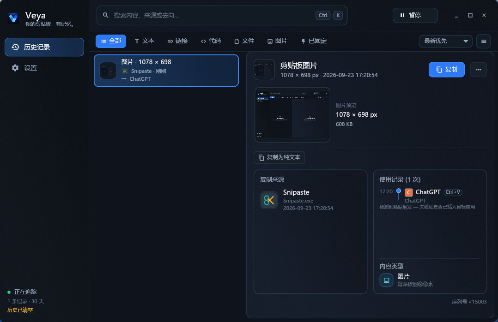

# Veya

**复制内容的来处与使用线索，一处查看。**

Veya 是面向 Windows 的原生剪贴板历史工具。它保存复制的文本、本地文件或文件夹列表、图片，以及可获得的来源信息；当你按下 `Ctrl+V` 或 `Shift+Insert` 时，也会记录当时的目标应用，帮助你回看内容的流转线索。历史和设置保存在本机。

## 界面预览

<p align="center">
  
</p>

左侧查找历史记录，右侧查看内容预览、复制来源和观察到的使用线索。

## 核心能力

- **找回复制内容**：在完整历史中搜索，并按文本、链接、代码、文件、图片或固定状态筛选；支持时间排序、两种列表密度，以及按页查看更早的记录。
- **看清来源与使用线索**：查看复制时的应用、窗口和来源置信度，以及之后观察到的粘贴快捷键、目标应用和时间。
- **继续使用内容**：把文本、仍然存在的本地文件路径列表或图片按原类型重新复制；点击图片缩略图可打开大图并缩放查看。文本还支持纯文本复制、链接打开和浏览器搜索。
- **控制保留范围**：固定重要记录，设置保留期，暂停追踪或排除应用；也可删除单条记录或清空全部历史。
- **快速唤起**：默认使用 `Alt+V` 显示或隐藏窗口；可修改或关闭组合键，也可通过系统托盘打开 Veya。

Veya 用 **Rust + Iced** 构建，剪贴板内容和历史记录存入本机 SQLite，不依赖 WebView2 或 Node.js 运行。
历史记录按页从 SQLite 读取；窗口隐藏或停在设置页时卸载历史卡片，重新打开时再读取。图片列表使用小缩略图，查看大图时才读取完整图片。

## 下载与安装

适用于 **Windows 10 / 11 x64**。从 [GitHub Releases](https://github.com/NGLSL/Veya/releases) 下载 `veya-setup.exe`；若发布页提供 `veya-setup.exe.sha256`，请核对安装包摘要。

本 README 描述当前源码；已发布安装包的功能请以对应版本的发布说明为准。

安装器需要管理员权限写入 Program Files。安装完成后可选择启动 Veya；程序会尝试以当前 Windows 用户的普通权限运行，避免影响其他工具的快捷键。安装包目前未签名，Windows 可能显示“未知发布者”。

覆盖安装和卸载不会删除历史数据库。需要清理或迁移数据时，请先查看下方的数据位置。

## 数据与准确性

历史和设置默认保存在 `%APPDATA%\Veya\veya.db`。Veya 没有历史记录的云端同步功能；手动检查更新或下载安装包会访问 GitHub，主动打开链接或网页搜索会交给对应的浏览器。

**“使用记录”是线索，不是粘贴成功证明。** Veya 观察到的是 `Ctrl+V` 或 `Shift+Insert` 及当时的前台应用，无法确认目标应用最终是否插入了内容。来源也可能因窗口切换或系统权限而只能推断，界面会标出置信度。

- 文件记录保存的是本地路径列表，不包含文件本身或剪切意图；源路径失效后无法按原文件列表重新复制。虚拟文件等 OLE 对象尚不支持。
- 图片捕获支持 `CF_DIB` / `CF_DIBV5` 位图，并保存为 PNG；其他格式、损坏或超限内容可能跳过。
- 链接和代码类别来自文本内容推断；普通路径字符串不会被当作文件记录。

## 从源码构建

需要 Rust stable 的 `x86_64-pc-windows-msvc` 工具链、Visual Studio Build Tools 和 Windows SDK。在仓库根目录运行：

```powershell
cargo test --workspace
cargo check --workspace
cargo run -p veya-desktop
```

构建安装包还需要 NSIS，命令和 Windows 手动验收步骤见 [开发文档](docs/DEVELOPMENT.md)。

## 项目结构

```text
veya-core/       剪贴板事件、使用线索与历史聚合
veya-storage/    SQLite 持久化、设置与保留期
veya-windows/    Win32 剪贴板、窗口、快捷键与托盘
veya-desktop/    Iced 界面与后台 worker
installer/       NSIS 安装脚本
docs/            架构、开发与发布文档
```

## 参与开发

请先阅读 [架构说明](docs/ARCHITECTURE.md)、[开发文档](docs/DEVELOPMENT.md) 和 [协作约定](AGENTS.md)。提交 PR 时请说明改动、验证命令和适用的 Windows 环境；涉及剪贴板、窗口、托盘或快捷键的行为，还需要真实 Windows 交互验证。
