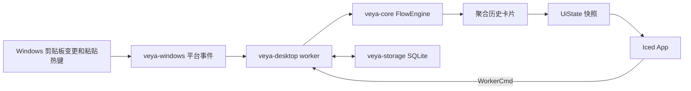

# Veya 架构与职责

本文描述当前 Windows 版的运行结构。功能状态以代码和 [README](../README.md) 为准；文件、图片和固定记录的设计与验收记录在 `.scratch/veya-history-v0.2/`。

## 数据流

1. `veya-windows/src/platform/` 的 Win32 消息循环发出 `PlatformEvent`。剪贴板信号包含内容及来源线索；低级键盘钩子发出粘贴触发线索；同一消息线程注册全局窗口快捷键，并在 `WM_HOTKEY` 到来时采样主窗口是否可见且未最小化。`enrich_clipboard`、`enrich_paste` 补充进程名、窗口名和时间信息。
2. `veya-desktop/src/worker.rs` 独占运行中的 `FlowEngine` 和 `Store`：加载数据库记录、处理平台事件和 `WorkerCmd`，把变化写回 SQLite，再通过 `snapshot_from_flow` 发布 `UiState`。追踪开关的 UI 请求带序号；快照回传已处理的序号，避免定时同步把刚点击的状态短暂覆盖为旧值。
3. `veya-desktop/src/app.rs` 的 Iced `App` 在 `Tick` 中读取快照并集中处理消息；`app/history.rs`、`app/detail.rs` 和 `app/settings.rs` 分别渲染历史、详情/完整内容弹窗和设置。`app/tracking.rs` 保存追踪开关尚未确认的请求，并用 worker 快照序号完成确认。复制、删除、排除应用等动作通过 `WorkerCmd` 发给 worker。
4. `veya-desktop/src/main.rs` 负责单例门禁、字体和 Iced 窗口装配。第二次启动通过 `veya-windows/src/platform/singleton.rs` 通知已有实例。热键在窗口可见时隐藏，在最小化或已隐藏时唤起；托盘和单例通知始终唤起。热键注册状态由 worker 发布到设置页。

## 模块职责与接口

| 模块 | 当前接口和所有权 |
| --- | --- |
| `veya-core` | `ClipboardPayload`、`ClipboardChange`、`PasteTrigger` 和 `FlowEngine`。决定载荷身份、内部重新复制抑制、粘贴触发关联、固定状态、历史聚合和搜索匹配；不访问 SQLite、Iced 或 Win32。 |
| `veya-storage` | `Store::open/load_all/insert_record/set_pinned/delete_records/purge_older_than`、设置和排除应用读写。负责旧文本库迁移、SQLite 载荷与固定状态持久化；不判断一次粘贴是否成功。 |
| `veya-windows` | Win32 剪贴板捕获与重放、键盘、进程/窗口、托盘、图标和单例。把系统事实转为平台事件或执行明确的系统动作；不排序历史卡片。 |
| `veya-desktop` | worker 编排、`UiState`/`CardView` 投影、Iced 消息和视图。`format.rs` 只把文本推断为普通文本、链接或代码；文件和图片按实际载荷显示和筛选。 |

依赖方向是 `veya-desktop` 使用三个下层 crate；`veya-storage` 和 `veya-windows` 只使用所需的 core 类型。当前没有跨平台 UI 适配层。

## 数据语义

- **原始复制事件**：`FlowEngine` 的 `ClipboardRecord` 与 `clipboard_record` 表按序列号保留事件。重复复制的合并只发生在 `history_cards()` 的展示投影中，不改写原始事件。
- **载荷与固定**：每个剪贴板序列按文件列表、DIB 图片、Unicode 文本的优先级只生成一条原始记录。文件保存有序本地路径列表；图片在 worker 中转成 PNG，SQLite 保存其字节和尺寸。固定状态属于原始记录，同一卡片固定时更新其中全部原始记录；固定与未固定记录不聚合。自动清理保留固定记录，明确清空全部历史会删除它们。
- **来源置信度**：`SourceConfidence` 区分精确、推断和未知；界面应按置信度显示来源，不把推断来源表述为精确来源。
- **使用记录**：`PasteTrigger` 表示观察到粘贴快捷键和当时的前台目标。它不是目标应用已插入内容的证明。
- **本机数据**：worker 默认使用 `%APPDATA%\Veya\veya.db`。保留期、排除应用和窗口唤起组合保存在库中；界面的搜索、排序和列表密度属于运行时展示状态。排除应用按 Windows 可执行文件名不区分大小写匹配，仅阻止后续复制记录；跳过一次复制时清除当前粘贴关联，已有历史不自动删除。
- **内容分类**：链接/代码是文本展示分类，文件和图片由真实载荷决定。路径字符串不能推断为文件，固定是跨内容类别的筛选属性。

## 系统动作

外部打开由 `veya-windows/src/platform/shell.rs` 执行，Iced 消息只传递明确的来源路径、链接或搜索文本。来源程序路径在选中记录变化时解析并缓存，详情视图只读取缓存。全局快捷键由平台消息线程注册、更换和释放；录制时暂时释放旧绑定，并在取消或窗口失焦后恢复。设置页录制时不渲染排除应用输入框，防止它保留键盘焦点。窗口圆角在启动或 Iced 窗口尺寸事件后有限次数同步，稳定窗口不会在每个 `Tick` 重复查询 Win32。

设置页的版本检查由 `veya-desktop/src/app/update.rs` 管理请求状态和后台线程，`veya-windows/src/platform/update.rs` 执行用户触发的 GitHub API 请求并比较稳定版标签。结果通过现有 Tick 回到 Iced 状态；仅在用户确认下载后，平台模块下载并校验安装包的大小和 SHA-256，再由 shell 请求 Windows 启动安装器。仓库及发布页链接仍交给平台 shell 打开。不会在渲染期间发起网络请求。

这组边界由已完成的 [系统动作任务](../.scratch/veya-project-foundation/issues/05-system-effects.md) 和 [桌面端拆分任务](../.scratch/veya-project-foundation/issues/04-desktop-app-split.md) 建立；后续新增系统行为继续放在 `veya-windows` 的具体接口中。
