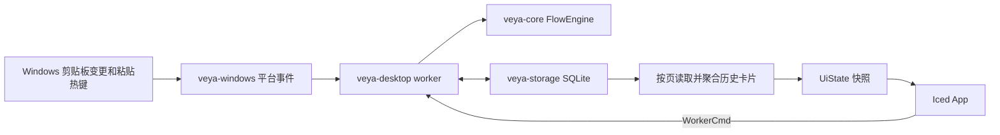

# Veya 架构与职责

本文描述当前 Windows 版的运行结构。功能状态以代码和 [README](../README.md) 为准；文件、图片和固定记录的设计与验收记录在 `.scratch/veya-history-v0.2/`。

## 数据流

```mermaid
flowchart LR
    OS[Windows 剪贴板变更和粘贴热键] --> P[veya-windows 平台事件]
    P --> W[veya-desktop worker]
    W --> F[veya-core FlowEngine]
    W <--> S[veya-storage SQLite]
    S --> A[按页读取并聚合历史卡片]
    A --> U[UiState 快照]
    U --> I[Iced App]
    I -->|WorkerCmd| W
```

1. `veya-windows/src/platform/` 的 Win32 消息循环发出 `PlatformEvent`。剪贴板信号包含内容及来源线索；低级键盘钩子发出粘贴触发线索；同一消息线程注册全局窗口快捷键，并在 `WM_HOTKEY` 到来时采样主窗口是否可见且未最小化。`enrich_clipboard`、`enrich_paste` 补充进程名、窗口名和时间信息。
2. `veya-desktop/src/worker.rs` 独占运行中的 `FlowEngine` 和事件写入使用的 `Store`：`FlowEngine` 只保留当前粘贴关联所需的活跃记录，完整历史保存在 SQLite。worker 处理平台事件和 `WorkerCmd`，把变化写回 SQLite。私有 `history_loader.rs` 后台线程持有独立的 `Store` 连接，按 `(created_at_ms, sequence)` 游标分批读取轻量历史投影，用 core 有序聚合器逐组筛选，每次只发布一页卡片。搜索、分类、固定筛选和排序仍应用于完整历史。追踪开关的 UI 请求带序号；快照回传已处理的序号，避免定时同步把刚点击的状态短暂覆盖为旧值。
3. `veya-desktop/src/app.rs` 的 Iced `App` 在 `Tick` 中读取快照并集中处理消息；`app/history.rs`、`app/detail.rs` 和 `app/settings.rs` 分别渲染历史、详情/完整内容弹窗和设置。`app/tracking.rs` 保存追踪开关尚未确认的请求，并用 worker 快照序号完成确认。复制、删除、排除应用等动作通过 `WorkerCmd` 发给 worker。
4. `veya-desktop/src/main.rs` 在单例门禁和键盘钩子启动前，通过 `veya-windows/src/platform/elevation.rs` 检查安装器继承的管理员权限，并尝试用 Explorer 用户令牌重新启动。之后负责单例门禁、字体和 Iced 窗口装配。第二次启动通过 `veya-windows/src/platform/singleton.rs` 通知已有实例。热键默认打开 `app/quick.rs` 的快捷粘贴面板，并在平台消息线程中立即采样外部目标 HWND/PID/TID；再次按热键可收起可见面板。托盘、单例通知和面板的“管理历史”打开完整窗口。热键注册状态由 worker 发布到设置页。

## 模块职责与接口

| 模块 | 当前接口和所有权 |
| --- | --- |
| `veya-core` | `ClipboardPayload`、`ClipboardChange`、`PasteTrigger` 和 `FlowEngine`，以及 `HistoryRecord` / `HistoryAggregator` / `HistorySummary`。决定载荷身份、内部重新复制抑制、粘贴触发关联、固定状态、历史聚合和搜索匹配；不访问 SQLite、Iced 或 Win32。 |
| `veya-storage` | 原始记录、`load_history_page` 轻量投影、`load_content` 全文，以及 `load_thumbnail/save_thumbnail` 派生缩略图缓存；设置和排除应用读写。负责旧文本库迁移、SQLite 载荷与固定状态持久化；不解码图片或判断一次粘贴是否成功。 |
| `veya-windows` | Win32 剪贴板捕获与重放、键盘、进程/窗口、托盘、图标和单例。把系统事实转为平台事件或执行明确的系统动作；不排序历史卡片。 |
| `veya-desktop` | worker 编排、`UiState`/`CardView` 投影、Iced 消息和视图。`format.rs` 只把文本推断为普通文本、链接或代码；文件和图片按实际载荷显示和筛选。 |

依赖方向是 `veya-desktop` 使用三个下层 crate；`veya-storage` 和 `veya-windows` 只使用所需的 core 类型。当前没有跨平台 UI 适配层。

## 数据语义

- **原始复制事件**：`clipboard_record` 表按序列号保留所有事件；运行中的 `FlowEngine` 只保留当前粘贴关联记录。重复复制的合并只发生在历史页的展示投影中，不改写原始事件。
- **载荷与固定**：每个剪贴板序列按文件列表、DIB 图片、Unicode 文本的优先级只生成一条原始记录。文件保存有序本地路径列表；图片在 worker 中转成 PNG，SQLite 保存其字节和尺寸。固定状态属于原始记录，同一卡片固定时更新其中全部原始记录；固定与未固定记录不聚合。自动清理保留固定记录，明确清空全部历史会删除它们。
- **来源置信度**：`SourceConfidence` 区分精确、推断和未知；界面应按置信度显示来源，不把推断来源表述为精确来源。
- **使用记录**：`PasteTrigger` 表示观察到粘贴快捷键和当时的前台目标。它不是目标应用已插入内容的证明。
- **本机数据**：worker 默认使用 `%APPDATA%\Veya\veya.db`。保留期、排除应用和窗口唤起组合保存在库中；界面的搜索、排序和列表密度属于运行时展示状态。排除应用按 Windows 可执行文件名不区分大小写匹配，仅阻止后续复制记录；跳过一次复制时清除当前粘贴关联，已有历史不自动删除。
- **内容分类**：链接/代码是文本展示分类，文件和图片由真实载荷决定。路径字符串不能推断为文件，固定是跨内容类别的筛选属性。
- **历史内存边界**：历史页每次显示 25 张卡片；后台读取投影不搬运 PNG，文本仅在分批匹配期间保留全文，卡片保存最多 512 字符的详情摘要和短列表预览。core 聚合器只保留一份代表记录内容及原始 ID／使用摘要，避免长重复组持有全部大内容。worker 私有 `HistoryPage` 与 `UiState.cards: Arc<[CardView]>` 共享当前页；查询条件或历史数据变化才重读，普通状态更新复用该页。相对时间在视图中由保存的时间戳计算。窗口隐藏、最小化或显示设置页时，取消旧加载并释放卡片、已加载全文和完整图片；重新显示历史页时再读取。
- **首屏与延后加载**：后台线程先提交可选择／重放的卡片，worker 发布快照后才允许逐张生成缩略图；图片未就绪时保留类型、尺寸和占位。待处理查询只保留最新请求，结果队列有界，查询／数据变化与退出历史页通过代数取消，旧回执不能覆盖当前页。最长边 128px 的 RGBA 缩略图按当前记录与内容哈希缓存在 SQLite，已有图片只在被显示时生成，没有启动全量回填。管理详情只按需保留一条完整内容，用 `Arc<str>` 分享给 UI；纯文本复制按原序列读取完整内容，不使用摘要。原图弹窗和 typed replay 仍按序列号读取完整原始载荷。

缩略图生成直接使用已有 `png` 解码依赖的逐行接口，常规 8-bit、非交错的大图只保留解码行与小图累加器，缩小后的像素与原 `image::thumbnail` 路径对照一致。小图、16-bit 或交错 PNG 沿用原图片解码路径；取消在逐行／阶段边界检查。缩略图失败有结束状态，原记录仍可选择并触发原图／重放操作。完整原图不受缩略图生成方式影响。
- **渲染器与字体**：桌面端使用 Iced 默认的 `wgpu` 渲染器；可显式设置 `ICED_BACKEND` 进行诊断。软件渲染器在 Windows 托盘恢复时可能短暂暴露系统标题栏，因此不作为默认选项。中文 UI 字体从 Iced 已扫描的系统字体中选择，沿用字体文件映射，不把字体文件再次读为私有字节。

## 系统动作

快捷粘贴先发送 `WorkerCmd::PreparePaste`，worker 按原类型重放并通过 `WorkerEvent::PastePrepared` 返回成功写入的剪贴板序号或失败。成功后将 core 当前粘贴关联切到所选原始记录，自身剪贴板变化仍被抑制，不新增复制记录。UI 收起面板后在独立线程调用 `platform/paste.rs`；目标身份、前台和剪贴板序号在发送前验证，并有界等待物理按键松开。前台已切到第三方窗口时取消，不能抢回目标。窗口任务携带会话序号，旧打开、取消和焦点恢复回执不能改变新会话。管理窗口的查询状态在快捷面板退出后恢复。

剪贴板监听读取与重放写入使用平台内部互斥锁，避免同一 owner HWND 的跨线程 Open/Close 干扰。写入关闭后重新只读打开，确认 owner 与原格式字节，再取得最终序号；Windows 自动补充格式可在首次关闭时推进序号。`ClipboardWriteError.changed` 区分写入前失败和已清空／写入后确认失败；后者取消自动粘贴并清除不可靠的旧关联，只对下一次精确本进程 owner 更新保留抑制。外部复制或非精确来源不受该一次性凭据影响。

外部打开由 `veya-windows/src/platform/shell.rs` 执行，Iced 消息只传递明确的来源路径、链接或搜索文本。来源程序路径在选中记录变化时解析并缓存，详情视图只读取缓存。全局快捷键由平台消息线程注册、更换和释放；录制时暂时释放旧绑定，并在取消或窗口失焦后恢复。设置页录制时不渲染排除应用输入框，防止它保留键盘焦点。首次显示和托盘恢复都经由 Iced 的窗口模式切换。窗口圆角在启动或 Iced 窗口尺寸事件后有限次数同步，稳定窗口不会在每个 `Tick` 重复查询 Win32。

设置页的版本检查由 `veya-desktop/src/app/update.rs` 管理请求状态和后台线程，`veya-windows/src/platform/update.rs` 执行用户触发的 GitHub API 请求并比较稳定版标签。结果通过现有 Tick 回到 Iced 状态；仅在用户确认下载后，平台模块下载并校验安装包的大小和 SHA-256，再由 shell 请求 Windows 启动安装器。仓库及发布页链接仍交给平台 shell 打开。不会在渲染期间发起网络请求。

这组边界由已完成的 [系统动作任务](../.scratch/veya-project-foundation/issues/05-system-effects.md) 和 [桌面端拆分任务](../.scratch/veya-project-foundation/issues/04-desktop-app-split.md) 建立；后续新增系统行为继续放在 `veya-windows` 的具体接口中。
